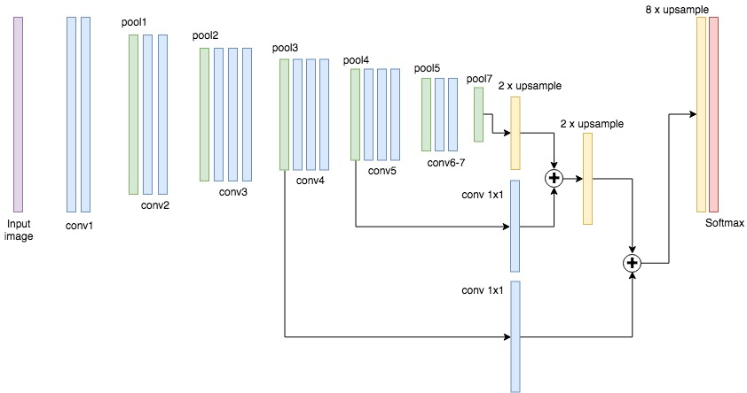
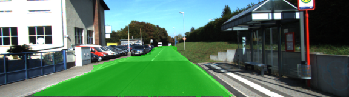
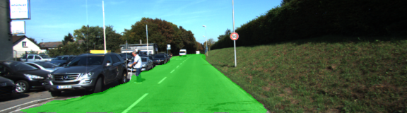
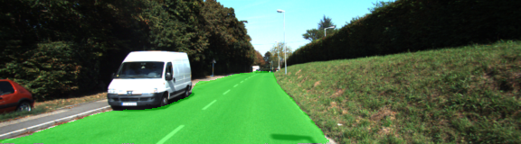
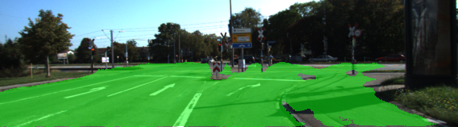

# Advanced Deep Learning Semantic Segmentation Project

## Introduction

The goal of this project is to construct a fully convolutional neural network based on the VGG-16 image classifier architecture for performing semantic segmentation to identify pixels that are of road that the car is currently driving on.

## Architecture

A NN was designed and trained to classify image pixels as road or not road. The NN uses a Fully Convolutional Network (FCN) composed of a encoder followed by a decoder. The VGG16 frozen NN was chosen as the encoder. The last fully connected layer of the VGG16 NN was converted to a fully convolutional network by converting the final fully connected layer to a 1x1 convolution and setting the depth equal to the number of desired classes (in this case, two: road and not-road). The decoder layers were composed of a combination of pooling and convolutional transposes that result in an upsampling of the image with pixel level classification. Performance is improved through the use of skip connections, performing 1x1 convolutions on previous VGG layers. Decoder implemenation is based on the [Fully Convolutional Networks for Semantic Segmentation](https://arxiv.org/abs/1605.06211) paper from UC Berkley.
The Architecture of the network is as follows

1. The output of the 1x1 convolution is upsampled (layers.conv2d_transpose) with a kernel size of 4 and step size of 2.
2. VGG16 layer 4 pooled output is added to the output of step 1.
3. Step 2 output is upsampled with a kernel size of 4 and step size of 2.
4. VGG16 layer 3 pooled output is added to the output of step 3.
5. Step 4 output is upsampled with a kernel size of 8 and step size of 4.
6. A softmax function is applied to the output of step 5.

Here is a pictorial representation of this network

## Optimizer 

The NN was trained using cross entropy loss function and Adam optimizer. L2 Regularization was employed.

## Training

The hyperparameters used for training are:

* keep_prob: 0.5
* learning_rate: 0.0001
* epochs: 20
* batch_size: 2

I tried multiple learning rate values ranging from 0.00001 to 0.0001 and epochs ranging from 20 to 60 and batch_size ranging from 2 to 15 and I found that the above combination is working great. The average cross entropy loss quickly reduces at each epoch run reaching below 10% already by 4th epoch. Here is a plot of loss per each epoch. I was able to train this network with the above hyper parameters in less than 30 minutes on an AWS g3.4xlarge instance.

## Result

The project labels most pixels of roads close to the best solution. There are some problematic images though where using image augmentation helped to improve the classification to certain extent. The augmentation implementation is added to the ``helper.py`` function. Below are a few sample images from the output of the fully convolutional network. Output with all the images from the run is found [here](https://github.com/vikram216/CarND-Semantic-Segmentation/tree/master/1535203709.823805)

